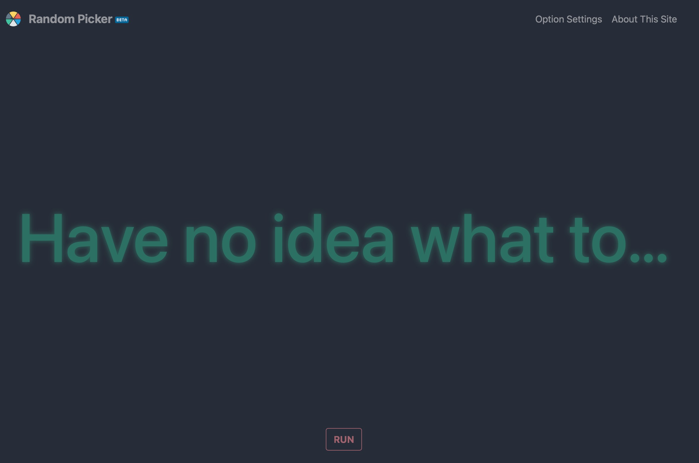

# Random Selection Tool

## Motivation

At work, as we approach noon, everyone has to think about what to have for lunch. In order to solve my colleagues' decision-making dilemma, I decided to write a random selection tool to alleviate their concerns.

## Application scenarios 
Since it's an open-ended tool for inputting options and randomly selecting the final result, it can be used in any situation related to decision-making, such as choosing a restaurant, picking lottery numbers, or determining if someone has a crush on you.

- **Random Picker**:

